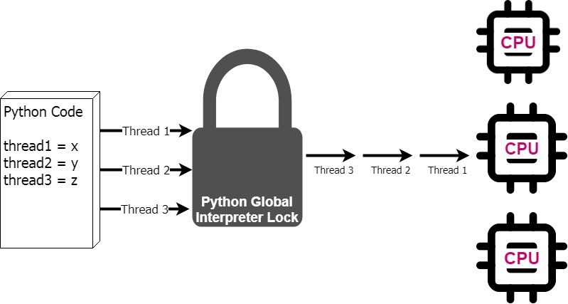
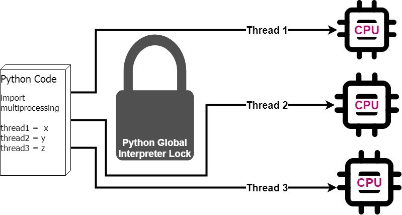

# Using Multiprocessing to Make Python Code Faster
The "multi" in multiprocessing refers to the multiple cores in a computer’s central processing unit (CPU). Computers originally had only one CPU core or processor, which is the unit that makes all our mathematical calculations possible. Today, computers typically have anywhere from 2 to 128 cores, meaning that taking advantage of more than one can dramatically improve processing time.

In Python, single-CPU use is caused by the **global interpreter lock (GIL)**, which allows only one thread to carry the Python interpreter at any given time. The GIL was implemented to handle a memory management issue, but as a result, Python is limited to using a single processor.



# Multiprocessing can dramatically improve processing speed
Bypassing the GIL when executing Python code allows the code to run faster because we can now take advantage of multiprocessing. Python’s built-in multiprocessing module allows us to designate certain sections of code to bypass the GIL and send the code to multiple processors for simultaneous execution.



In this simplified example, assuming all three threads had identical runtimes, the multiprocessing solution would cut total execution time by a third. But this reduction isn’t exactly proportionate to the number of processors available because of the overhead involved in creating multiprocessing processes, but the gains represent a significant improvement over single-core operations.

# Three requirements for multiprocessing
Before you can begin multiprocessing, you need to pick which sections of code to multiprocess. These sections of code must meet the following criteria:

1. Must not be reliant on previous outcomes
2. Does not need to be executed in a particular order
3. Does not return anything that would need to be accessed later in the code

# Example
```python
import time

def basic_func(x):
    if x == 0:
        return 'zero'
    elif x%2 == 0:
        return 'even'
    else:
        return 'odd'
    
starttime = time.time()
for i in range(0,10):
    y = i*i
    time.sleep(2)
    print('{} squared results in a/an {} number'.format(i, basic_func(y)))
    
print('That took {} seconds'.format(time.time() - starttime))
```
This example took about **20.019609451293945** seconds.

The traditional for-loop iteration goes through the list one by one and performs the functions on each item individually. In this model, the loops use only 30 to 40 percent of the available CPU power. If we were to use multiprocessing, the function would be executed on multiple list items at once and up to 100 percent of the CPU could be used on a multicore machine. Best of all, we would see a dramatic reduction in execution time.

# How to use multiprocessing: The Process class and the Pool class
The multiprocessing Python module contains _two classes_ capable of handling tasks. The Process class sends each task to a different processor, and the Pool class sends sets of tasks to different processors. We will show how to multiprocess the example code using both classes. Although both classes provide a similar speed increase, the Process class is more efficient in this case because there are not many processes to execute.

**Pool is most useful for large amounts of processes where each process can execute quickly, while Process is most useful for a small number of processes where each process would take a longer time to execute.**

To use the Process class, place the functions and calculations that are done on each list item in its own function that will take a list item as one of its arguments. Next, import the multiprocessing module, create a new process for each list item, and trigger each process in one call. We keep track of these processes by making a list and adding each process to it. After creating all the processes, take the separate output of each CPU and join them into a single list.

```python
import time
import multiprocessing 

def basic_func(x):
    if x == 0:
        return 'zero'
    elif x%2 == 0:
        return 'even'
    else:
        return 'odd'

def multiprocessing_func(x):
    y = x*x
    time.sleep(2)
    print('{} squared results in a/an {} number'.format(x, basic_func(y)))
    
if __name__ == '__main__':
    starttime = time.time()
    processes = []
    for i in range(0,10):
        p = multiprocessing.Process(target=multiprocessing_func, args=(i,))
        processes.append(p)
        p.start()
        
    for process in processes:
        process.join()
        
    print('That took {} seconds'.format(time.time() - starttime))
```

_For reference see: https://medium.com/@urban_institute/using-multiprocessing-to-make-python-code-faster-23ea5ef996ba_
